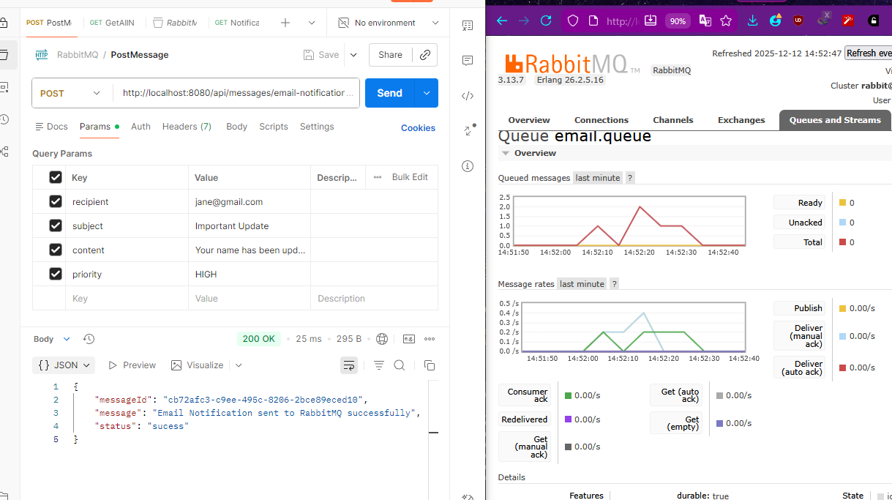
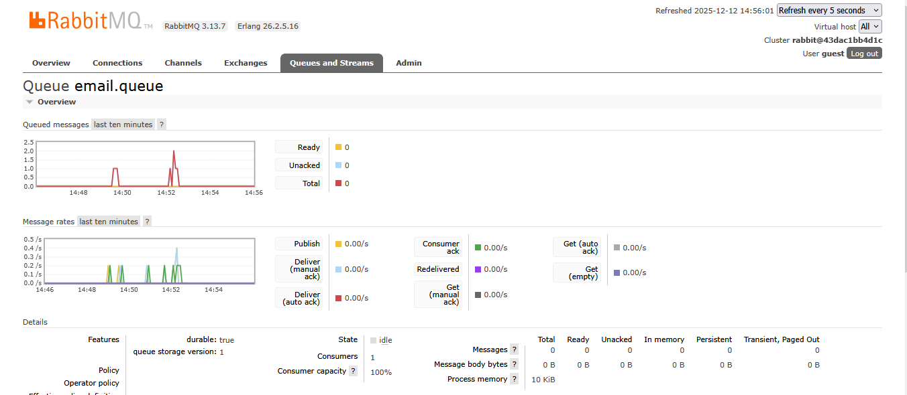
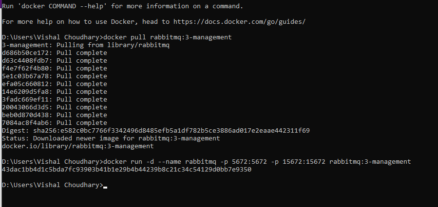
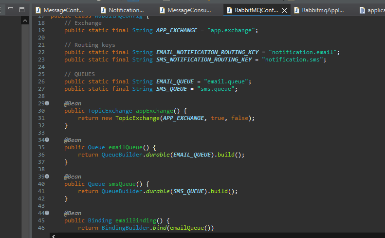

# 📬 RabbitMQ Notification Service  
A simple Spring Boot application demonstrating **RabbitMQ message publishing & consumption** using **Topic Exchange**, **multiple queues**, **PostgreSQL persistence**, and **Docker-based RabbitMQ setup**.

This project simulates a **Notification System** where users trigger notifications (Email/SMS). Messages are sent to **RabbitMQ**, consumed by listeners, and finally stored in a relational database.

---

## 🚀 Features
- Publish notifications to RabbitMQ using **Topic Exchange**
- Two routing keys:  
  - `notification.email` → `email.queue`  
  - `notification.sms` → `sms.queue`
- Durable queues  
- Consumers listening on each queue  
- PostgreSQL DB stores processed notifications  
- REST APIs to:
  - Send notifications  
  - Fetch saved notifications  
- Dockerized RabbitMQ with Management UI  
- Visual RabbitMQ queue activity graphs  

---

       REST API (Spring Boot)
               |
               | Publishes
               v
        ----------------------
        |    Topic Exchange   |
        ----------------------
           |               |
---

## 📦 Tech Stack
- **Spring Boot**
- **Spring AMQP**
- **RabbitMQ**
- **PostgreSQL**
- **Docker**
- **Spring Data JPA**

---

# 🖼️ Project Demonstration

### 1️⃣ Sending a Notification  


---

### 2️⃣ Notification Saved to PostgreSQL  


---

### 3️⃣ RabbitMQ Queue Activity  


---

### 4️⃣ Docker Commands Used  


---

### 5️⃣ Application Configuration  


---

# 🐇 RabbitMQ Setup with Docker

### 1. Pull the RabbitMQ image  
```sh
docker pull rabbitmq:3-management


docker run -d --name rabbitmq \
  -p 5672:5672 \
  -p 15672:15672 \
  rabbitmq:3-management

RabbitMQ UI → http://localhost:15672
Default credentials:
Username: guest
Password: guest

A complete working example covering:
Producer → Exchange → Queue → Consumer → Database
RabbitMQ setup via Docker
Clean microservices-style messaging
Queue monitoring with graphs
PostgreSQL persistence
